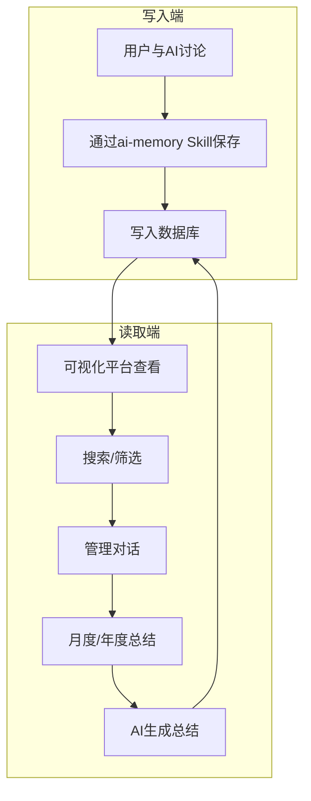

# Personal Capability Center / 个人能力中心

Personal Capability Center是一个基于PostgreSQL + pgvector的个人知识管理系统，实现AI对话内容的结构化存储、可视化管理和智能化成长分析。

## 系统定义

Personal Capability Center由以下两部分组成：

### 1. ai-memory（Skill）
- 面向用户私有AI的插件模块
- 通过AI对话交互，将高价值内容持久化至数据库
- 职责：数据写入

### 2. 可视化平台（前端 + 后端）
- 提供对话内容的查询、筛选与管理功能
- 支持月度/年度报告的自动生成
- 职责：数据读取、管理与分析

---

## 项目结构

```
ai-memory-dashboard/
├── ai-memory/                # OpenCode AI Memory Skill
│   ├── SKILL.md             # Skill 文档
│   ├── scripts/             # Python SDK
│   │   ├── ai_memory.py     # AIMemory 类
│   │   ├── test_ai_memory.py  # 测试脚本
│   │   └── quick_test.py    # 快速测试
│   ├── references/          # 完整文档
│   │   ├── API_REFERENCE.md
│   │   ├── INSTALL.md
│   │   ├── CONTENT_GUIDELINES.md
│   │   ├── TESTING.md
│   │   ├── WSL2_TROUBLESHOOTING.md
│   │   ├── EXAMPLES.md
│   │   ├── LANGCHAIN.md
│   │   └── SCHEMA.md
│   └── .env.example         # 环境变量示例
│
├── backend/                   # 后端服务 (FastAPI)
│   ├── main.py              # FastAPI 主程序
│   ├── database.py          # 同步数据库连接
│   ├── database_async.py    # 异步数据库连接
│   ├── models.py            # Pydantic 数据模型
│   ├── routers/             # API 路由
│   │   ├── conversations.py # 对话管理 API
│   │   ├── search.py        # 搜索 API
│   │   ├── statistics.py    # 统计 API
│   │   └── summary.py       # 总结 API
│   ├── scripts/             # 工具脚本
│   │   └── init-db.sh       # 数据库初始化
│   ├── docker-compose.yml   # PostgreSQL + pgvector Docker 配置
│   ├── requirements.txt     # Python 依赖
│   └── .env.example         # 环境变量示例
│
├── frontend/                 # 前端应用 (React + Vite)
│   ├── src/
│   │   ├── components/      # React 组件
│   │   │   ├── App.tsx
│   │   │   ├── ConversationList.tsx
│   │   │   ├── ConversationDetail.tsx
│   │   │   ├── SearchPage.tsx
│   │   │   ├── SummaryPage.tsx
│   │   │   └── StatisticsPage.tsx
│   │   ├── services/         # API 调用服务
│   │   │   └── api.ts
│   │   ├── types/            # TypeScript 类型定义
│   │   │   └── index.ts
│   │   ├── assets/           # 静态资源
│   │   ├── App.css
│   │   ├── index.css
│   │   └── main.tsx          # 前端入口
│   ├── public/               # 公共静态文件
│   ├── package.json          # 前端依赖配置
│   ├── vite.config.ts        # Vite 配置
│   └── tsconfig.json        # TypeScript 配置
│
├── docs/                      # 项目文档
│   ├── ARCHITECTURE.md      # 系统架构文档
│   ├── DEVELOPMENT.md       # 开发指南
│   ├── API.md              # API 文档
│   └── DEPLOYMENT.md       # 部署指南
│
├── .gitignore              # Git 忽略文件配置
├── README.md              # 项目说明（本文件）
└── PRIVACY_CHECK.md       # 隐私检查指南
```

---

## 核心流程



### 流程说明

1. **写入阶段**：用户与AI讨论有价值的内容 → 通过ai-memory Skill保存到数据库
2. **读取阶段**：可视化平台查看对话列表
3. **检索阶段**：关键词、标签、重要性等搜索
4. **管理阶段**：删除不需要的对话
5. **总结阶段**：月度/年度总结 → AI生成 → 保存回数据库

---

## 快速开始

### 环境要求

- **Docker Desktop** - 用于运行 PostgreSQL + pgvector 数据库
- **Python 3.8+** - 后端运行环境
- **Node.js 18+** - 前端运行环境
- **OpenCode** - AI 助手（用于 ai-memory Skill）

---

### Step 1: 启动数据库

进入后端目录，使用 Docker Compose 启动 PostgreSQL + pgvector：

```bash
cd backend
docker-compose up -d
```

数据库会自动执行初始化脚本，创建以下内容：
- ✅ pgvector 扩展
- ✅ conversations 表（对话记录）
- ✅ tags 表（标签）
- ✅ conversation_tags 关联表
- ✅ 向量列（用于语义搜索）

验证数据库是否启动成功：

```bash
docker ps | grep ai-memory-postgres
```

---

### Step 2: 启动后端

#### 2.1 安装 Python 依赖

```bash
cd backend
pip install -r requirements.txt
```

#### 2.2 配置环境变量

从示例配置文件创建 `.env` 文件：

```bash
# Windows (PowerShell)
cd backend
Copy-Item .env.example .env

# Linux/Mac
cd backend
cp .env.example .env
```

`.env` 文件包含以下配置（已包含必要的 CORS 配置）：

```bash
# 数据库连接
AI_MEMORY_HOST=localhost
AI_MEMORY_PORT=5432
AI_MEMORY_DB=ai_memory
AI_MEMORY_USER=ai_user
AI_MEMORY_PASSWORD=ai_password_123

# API 服务
API_HOST=0.0.0.0
API_PORT=8000
CORS_ORIGINS=http://localhost:5173,http://localhost:3000,http://127.0.0.1:5173

# OpenCode 集成
OPENCODE_API_URL=http://127.0.0.1:4096
```

**注意**：`.env` 文件已在 `.gitignore` 中，不会被提交到 Git 仓库。

#### 2.3 启动后端服务

```bash
python main.py
```

后端会运行在：**http://localhost:8000**

查看 API 文档：**http://localhost:8000/docs**

---

### Step 3: 启动前端

#### 3.1 安装 Node.js 依赖

```bash
cd frontend
npm install
```

#### 3.2 启动前端开发服务器

```bash
npm run dev
```

前端会运行在：**http://localhost:5173**

---

### Step 4: 部署 ai-memory Skill 到 OpenCode

#### 4.1 找到 OpenCode skill 目录

通常位于：
```
C:\Users\{你的用户名}\.config\opencode\skills\
```

#### 4.2 复制 ai-memory 文件夹

```bash
# Linux/Mac
cp -r ai-memory ~/.config/opencode/skills/

# Windows (PowerShell)
Copy-Item -Recurse ai-memory "$env:USERPROFILE\.config\opencode\skills\"

# 或者手动复制 ai-memory 文件夹到 OpenCode 的 skills 目录
```

复制后的目录结构：
```
ai-memory/
├── SKILL.md              # 技能文档（~100行）
├── scripts/
│   └── ai_memory.py      # AIMemory 类
└── references/           # 完整文档
    ├── API_REFERENCE.md  # API 参考
    ├── INSTALL.md        # 详细安装指南
    ├── CONTENT_GUIDELINES.md  # 内容存储指南
    ├── TESTING.md        # 测试与验证
    └── WSL2_TROUBLESHOOTING.md # 故障排查
```

#### 4.3 重启 OpenCode

重启你的 OpenCode，让技能系统加载更新后的 skill。

---

### Step 5: 开始使用

#### 5.1 通过 Skill 记录 AI 对话

现在你的 OpenCode AI 可以：

```python
from ai_memory.ai_memory import AIMemory

# 连接到数据库
memory = AIMemory()

# 添加和AI讨论后的有价值内容
memory.add_conversation(
    title="学习向量搜索",
    summary="学习了pgvector的使用方法",
    details="1. 安装pgvector扩展\n2. 创建向量列\n3. 使用vector搜索API...",
    tags=["Python", "向量搜索"],
    importance=8,
    word_count=50
)

# 关闭连接
memory.close()
```

#### 5.2 通过前端查看和管理

访问 **http://localhost:5173**

**完整工作流程**：
1. 与 AI 讨论有价值的内容
2. 通过 Skill 保存到数据库（记录 AI 对话、技能知识、关键结论）
3. 前端查看和管理（对话列表、搜索、统计）
4. 点击月度/年度总结
5. 后端调用 OpenCode 生成总结
6. 总结保存回数据库（你查看能力提升）
7. 继续与 AI 讨论...

---

## 技术栈

### 后端
- **FastAPI** - 高性能异步Web框架
- **PostgreSQL 16** - 关系型数据库
- **pgvector** - 向量相似度搜索，支持HNSW算法加速百万级向量检索
- **httpx** - 异步HTTP客户端
- **Pydantic** - 数据验证

### 前端
- **React 18** - UI框架
- **Vite** - 极速构建工具
- **Tailwind CSS** - 实用优先的CSS框架
- **shadcn/ui** - 高质量UI组件库
- **Framer Motion** - 动画库

### AI Memory Skill
- **Python SDK** - 完整的AIMemory类，可直接调用数据库操作
- **渐进式加载** - 三级加载机制（metadata → SKILL.md → references）
- **API完整** - 所有方法的完整文档和示例

---

## 故障排查

### 后端启动失败

```bash
# 检查PostgreSQL是否运行
docker ps | grep postgresql

# 查看后端日志
cd backend
cat backend.log
```

### 数据库连接失败

```bash
# 测试数据库连接
PGPASSWORD=ai_password_123 psql -h localhost -U ai_user -d ai_memory -c "SELECT version();"
```

### OpenCode API调用失败

```bash
# 检查OpenCode是否运行
curl http://127.0.0.1:4096/health

# 检查.env配置
cat backend/.env | grep OPENCODE_API_URL
```

### Windows WSL2问题

- 确保Docker Desktop正在运行
- 检查WSL2版本：`wsl --version`
- 参考`ai-memory/references/WSL2_TROUBLESHOOTING.md`

---

## 完整文档

更详细的文档请参考：

### 核心文档
- **README.md** - 项目概述和快速开始（本文件）
- **PROJECT_STRUCTURE.md** - 项目结构说明和重构指南
- **ARCHITECTURE.md** - 系统架构文档
- **DEVELOPMENT.md** - 开发指南
- **PRIVACY_CHECK.md** - 隐私检查与清理指南

### AI Memory Skill
- **AI Memory Skill**：`skill/SKILL.md` - Python SDK完整文档
- **API参考**：`skill/references/API_REFERENCE.md` - 所有API方法说明
- **安装指南**：`skill/references/INSTALL.md` - 详细的安装步骤
- **内容存储**：`skill/references/CONTENT_GUIDELINES.md` - 如何正确存储对话内容
- **测试验证**：`skill/references/TESTING.md` - 测试脚本和验证方法
- **故障排查**：`skill/references/WSL2_TROUBLESHOOTING.md` - WSL2和PostgreSQL问题

### 后端文档
- **后端安装指南**：`backend/docs/INSTALL.md`
- **后端 API 参考**：`backend/docs/references/API_REFERENCE.md`

---

## 贡献

欢迎提交 Issue 和 Pull Request！

---
