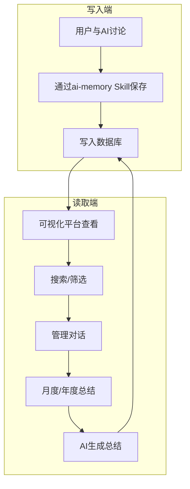

# Personal Capability Center / 个人能力中心

[](https://github.com/shadowabi/personal-capability-center/issues)
[](https://github.com/shadowabi/personal-capability-center/network/members)
[](https://github.com/shadowabi/personal-capability-center/stargazers)

Personal Capability Center是一个基于PostgreSQL + pgvector的个人知识管理系统，实现AI对话内容的结构化存储、可视化管理和智能化成长分析。

## 核心理念

### 对话即能力
每一次与AI的对话都是一次知识交互，通过结构化存储和管理，将零散的对话转化为可追溯、可分析的个人能力资产。

### 引导式成长
通过月度/年度报告功能，系统化回顾和总结，实现能力的持续迭代和提升。

### 系统能力
- **结构化存储**：将AI对话内容存储为可查询、可管理的结构化数据
- **语义搜索**：基于pgvector的向量搜索，实现智能化的内容检索
- **成长分析**：通过统计和报告功能，可视化展示能力成长轨迹

## 系统定义

Personal Capability Center由以下两部分组成：

### 1. ai-memory（Skill）
- 面向用户AI的SKILL模块
- 提供一整套操作记忆数据库写入和读取的功能
- 职责：数据写入

### 2. 可视化平台（前端 + 后端）
- 提供对话内容的查询、筛选与管理功能
- 支持月度/年度报告的自动生成
- 职责：数据读取、管理与分析

## 平台特性

### 智能记忆管理
- 对话内容的结构化存储（标题、内容、来源时间）
- 标签分类和管理
- 重要性标记（高/中/低）

### 能力盘点系统
- 对话列表查看和筛选
- 基于pgvector的语义搜索
- 统计分析功能

### 报告生成
- 月度/年度总结功能
- AI自动生成总结报告
- 报告保存回数据库

### 对话即能力
- **SKILL模块**：Python SDK提供完整的数据库写入/读取API
- **可视化平台**：Web界面对话管理和查询
- **按需交互**：减少token消耗，仅在用户要求时产生交互

### 系统特性
- **私有化部署**：数据存储在本地PostgreSQL
- **模块化架构**：可接入不同AI工具（OpenCode、OpenClaw等）
- **按需写入/读取**：独立的系统，仅用户要求时产生交互

## 使用示例

### 场景1：记录AI对话
```
用户：使用 AI-Memory SKILL 总结当前对话并写入
AI：已保存对话到数据库（标题：如何使用PostgreSQL）
```

### 场景2：查询历史对话
```
用户：使用 AI-Memory SKILL 查看关于向量搜索的对话
AI：找到3条相关对话：
1. pgvector基础使用（2025-12-01）
2. 语义搜索优化（2025-12-05）
...
```

### 场景3：生成月度总结
1. 登录前端平台（http://localhost:5173）
2. 点击"月度总结"按钮
3. 后端调用OpenCode AI生成总结
4. 查看能力提升报告

## 适用场景

- **AI知识管理**：长期保存与AI的对话，形成个人知识库
- **技能成长追踪**：通过月度/年度报告，系统化回顾学习成果
- **学习资源回顾**：基于语义搜索，快速找到历史相关讨论
- **个人能力盘点**：通过统计分析，了解自己的学习重点和成长轨迹

## 技术亮点

### 后端技术
- **FastAPI**：高性能异步Web框架，支持自动API文档生成
- **PostgreSQL 16 + pgvector**：支持向量相似度搜索，HNSW算法加速百万级向量检索

### 前端技术
- **React 18 + Vite**：现代化前端架构，极速构建体验
- **shadcn/ui**：高质量UI组件库
- **Framer Motion**：流畅的动画效果

### AI集成
- **Python SDK**：完整的AIMemory类，可直接调用数据库操作
- **渐进式加载**：三级加载机制（metadata → SKILL.md → references）

---

## 项目结构

```
ai-memory-dashboard/
├── ai-memory/                # AI Memory Skill
│   ├── SKILL.md             # Skill 文档
│   ├── scripts/             # Python SDK
│   │   ├── ai_memory.py     # AIMemory 类
│   │   ├── test_ai_memory.py  # 测试脚本
│   │   └── quick_test.py    # 快速测试
│   ├── references/          # 完整文档
│   │   ├── API_REFERENCE.md
│   │   ├── INSTALL.md
│   │   ├── CONTENT_GUIDELINES.md
│   │   ├── TESTING.md
│   │   ├── WSL2_TROUBLESHOOTING.md
│   │   ├── EXAMPLES.md
│   │   ├── LANGCHAIN.md
│   │   └── SCHEMA.md
│   └── .env.example         # 环境变量示例
│
├── backend/                   # 后端服务 (FastAPI)
│   ├── main.py              # FastAPI 主程序
│   ├── database.py          # 同步数据库连接
│   ├── database_async.py    # 异步数据库连接
│   ├── models.py            # Pydantic 数据模型
│   ├── routers/             # API 路由
│   │   ├── conversations.py # 对话管理 API
│   │   ├── search.py        # 搜索 API
│   │   ├── statistics.py    # 统计 API
│   │   └── summary.py       # 总结 API
│   ├── scripts/             # 工具脚本
│   │   └── init-db.sh       # 数据库初始化
│   ├── docker-compose.yml   # 数据库初始化
│   ├── requirements.txt     # Python 依赖
│   └── .env.example         # 环境变量示例
│
├── frontend/                 # 前端应用 (React + Vite)
│   ├── src/
│   │   ├── components/      # React 组件
│   │   │   ├── App.tsx
│   │   │   ├── ConversationList.tsx
│   │   │   ├── ConversationDetail.tsx
│   │   │   ├── SearchPage.tsx
│   │   │   ├── SummaryPage.tsx
│   │   │   └── StatisticsPage.tsx
│   │   ├── services/         # API 调用服务
│   │   │   └── api.ts
│   │   ├── types/            # TypeScript 类型定义
│   │   │   └── index.ts
│   │   ├── assets/           # 静态资源
│   │   ├── App.css
│   │   ├── index.css
│   │   └── main.tsx          # 前端入口
│   ├── public/               # 公共静态文件
│   ├── package.json          # 前端依赖配置
│   ├── vite.config.ts        # Vite 配置
│   └── tsconfig.json        # TypeScript 配置
│
├── docs/                      # 项目文档
│   ├── ARCHITECTURE.md      # 系统架构文档
│   ├── DEVELOPMENT.md       # 开发指南
│   ├── API.md              # API 文档
│   └── DEPLOYMENT.md       # 部署指南
│
├── .gitignore              # Git 忽略文件配置
├── README.md              # 项目说明（本文件）
└── PRIVACY_CHECK.md       # 隐私检查指南
```

---

## 核心流程



### 流程说明

1. **保存阶段**：用户与AI讨论有价值的内容 → 通过ai-memory Skill保存掌握的能力（抽象层）
2. **读取阶段**：可视化平台查看能力记录
3. **检索阶段**：关键词、标签、重要性等搜索
4. **管理阶段**：删除不需要的能力记录
5. **提炼阶段**：月度/年度能力盘点 → AI综合分析所有能力记录，进行体系化 → 保存回数据库

---

## 快速开始

### 环境要求

- **Docker** - 用于运行所有服务（数据库 + 后端 + 前端）
- **OpenCode**（可替换） - AI 助手，用于与数据库交互以及知识总结

### 部署方式对比

| 部署方式 | 适用场景 | 优点 | 缺点 |
|---------|---------|------|------|
| Docker Compose | 快速启动、生产环境 | 一键部署、环境隔离 | 需要安装Docker |
| 手动部署 | 开发调试 | 灵活控制、便于调试 | 需要手动配置环境 |

---

### 方式一：使用 Docker Compose 一键部署（推荐）

#### 1. 启动所有服务

进入项目根目录，使用 Docker Compose 启动所有服务：

```bash
cd F:\test\ai-memory-dashboard
docker compose up -d
```

这会自动启动以下三个微服务：
- ✅ **PostgreSQL + pgvector** (端口 5432)
- ✅ **FastAPI 后端** (端口 8000)
- ✅ **React + Vite 前端** (端口 5173)

#### 2. 验证服务状态

查看所有服务是否正常运行：

```bash
docker compose ps
```

应该看到三个服务都显示为 `Up` 或 `Up (healthy)` 状态。

#### 3. 测试访问

**测试后端 API**：
```bash
curl http://localhost:8000/health
```
应该返回：`{"status":"healthy"}`

**测试前端**：
```bash
curl -I http://localhost:5173
```
应该返回 `HTTP/1.1 200 OK`

**查看 API 文档**：
访问 http://localhost:8000/docs

#### 4. 配置 OpenCode AI（可选）

如果你想使用月度/年度总结功能，需要配置 OpenCode AI：

```bash
# 复制配置模板
cd backend
cp .env.example .env.local

# 编辑 .env.local，填入你的配置
# AGENT_NAME=your-agent-name
# MODEL_ID=your-model-id
# PROVIDER_ID=your-provider-id
```

详细配置说明请参考：[CONFIGURATION.md](./CONFIGURATION.md)

#### 5. 停止服务

```bash
# 停止所有服务
docker compose stop

# 停止并删除容器
docker compose down

# 停止、删除容器和卷（会删除数据）
docker compose down -v
```

---

### 方式二：手动部署（开发调试）

> **注意**：手动部署需要手动配置环境变量。推荐使用Docker Compose一键部署。

#### Step 1: 启动数据库

进入后端目录，使用 Docker Compose 启动数据库：

```bash
cd backend
docker-compose up -d
```

数据库会自动执行初始化脚本，创建以下内容：
- ✅ pgvector 扩展
- ✅ conversations 表（对话记录）
- ✅ tags 表（标签）
- ✅ conversation_tags 关联表
- ✅ 向量列（用于语义搜索）

验证数据库是否启动成功：

```bash
docker ps | grep ai-memory-postgres
```

#### Step 2: 启动后端

##### 2.1 安装 Python 依赖

```bash
cd backend
pip install -r requirements.txt
```

##### 2.2 配置环境变量

从示例配置文件创建 `.env` 文件：

```bash
# Windows (PowerShell)
cd backend
Copy-Item .env.example .env

# Linux/Mac
cd backend
cp .env.example .env
```

`.env` 文件包含以下配置：

```bash
# 数据库连接
AI_MEMORY_HOST=localhost
AI_MEMORY_PORT=5432
AI_MEMORY_DB=ai_memory
AI_MEMORY_USER=ai_user
AI_MEMORY_PASSWORD=ai_password_123

# 后端 API 服务
API_HOST=0.0.0.0
API_PORT=8000
# CORS 防护配置
CORS_ORIGINS=http://localhost:5173,http://localhost:3000,http://127.0.0.1:5173

# OpenCode 集成
OPENCODE_API_URL=http://127.0.0.1:4096
```

**注意**：`.env` 文件已在 `.gitignore` 中，不会被提交到 Git 仓库。

##### 2.3 启动后端服务

```bash
python main.py
```

后端会运行在：**http://localhost:8000**

查看 API 文档：**http://localhost:8000/docs**

#### Step 3: 启动前端

##### 3.1 安装 Node.js 依赖

```bash
cd frontend
npm install
```

##### 3.2 启动前端开发服务器

```bash
npm run dev
```

前端会运行在：**http://localhost:5173**

---

### Step 4: 配置 OpenCode AI（可选，用于月度/年度总结）

如果你想使用月度/年度总结功能，需要配置 OpenCode AI：

#### 4.1 创建配置文件

```bash
cd backend
cp .env.example .env
```

#### 4.2 修改配置文件

编辑 `backend/.env`，添加 OpenCode 配置：

```bash
# OpenCode Agent 配置
AGENT_NAME=your-agent-name
MODEL_ID=your-model-id
PROVIDER_ID=your-provider-id

# OpenCode API 地址
OPENCODE_API_URL=http://127.0.0.1:4096
```

**如何获取配置信息**：
```bash
# 查看 available agents
curl -s http://127.0.0.1:4096/agent

# 查看 available models and providers
curl -s http://127.0.0.1:4096/config/providers
```

#### 4.3 重启后端服务

```bash
# 停止后端服务
# Ctrl+C 或 kill 进程

# 重新启动
cd backend
python main.py
```

详细配置说明请参考：[CONFIGURATION.md](./CONFIGURATION.md)

### Step 5: 部署 ai-memory Skill 到 OpenCode（可替换）

#### 4.1 找到 OpenCode skill 目录

通常位于：
```
C:\Users\{你的用户名}\.config\opencode\skills\
```

#### 4.2 复制 ai-memory 文件夹

```bash
# Linux/Mac
cp -r ai-memory ~/.config/opencode/skills/

# Windows (PowerShell)
Copy-Item -Recurse ai-memory "$env:USERPROFILE\.config\opencode\skills\"

# 或者手动复制 ai-memory 文件夹到 OpenCode 的 skills 目录
```

复制后的目录结构：
```
ai-memory/
├── SKILL.md              # 技能文档（~100行）
├── scripts/
│   └── ai_memory.py      # AIMemory 类
└── references/           # 完整文档
    ├── API_REFERENCE.md  # API 参考
    ├── INSTALL.md        # 详细安装指南
    ├── CONTENT_GUIDELINES.md  # 内容存储指南
    ├── TESTING.md        # 测试与验证
    └── WSL2_TROUBLESHOOTING.md # 故障排查
```

#### 4.3 重启 OpenCode（可替换）

重启你的 OpenCode，让技能系统加载更新后的 skill。

---

### Step 5: 开始使用

#### 5.1 通过 Skill 记录 AI 对话

现在你的 OpenCode AI 可以使用SKILL操作数据库：

```
查询：使用 AI-Memory SKILL 查看关于XXX的对话
插入：使用 AI-Memory SKILL 总结当前对话并写入
```

#### 5.2 通过前端查看和管理

访问 **http://localhost:5173**

**完整工作流程**：
1. 与 AI 讨论有价值的内容
2. 通过 Skill 保存到数据库（记录掌握的能力、深刻洞察、认知转变）
3. 前端查看和管理（能力记录列表、搜索、统计）
4. 点击月度/年度能力盘点
5. 后端调用 OpenCode 综合分析所有能力记录
6. 总结保存回数据库（你查看能力成长轨迹、能力评估、成长建议）
7. 继续与 AI 讨论...

---

## 技术栈

### 后端
- **FastAPI** - 高性能异步Web框架
- **PostgreSQL 16** - 关系型数据库
- **pgvector** - 向量相似度搜索，支持HNSW算法加速百万级向量检索
- **httpx** - 异步HTTP客户端
- **Pydantic** - 数据验证

### 前端
- **React 18** - UI框架
- **Vite** - 极速构建工具
- **Tailwind CSS** - 实用优先的CSS框架
- **shadcn/ui** - 高质量UI组件库
- **Framer Motion** - 动画库

### AI Memory Skill
- **Python SDK** - 完整的AIMemory类，可直接调用数据库操作
- **渐进式加载** - 三级加载机制（metadata → SKILL.md → references）
- **API完整** - 所有方法的完整文档和示例

---

## 故障排查

### 后端启动失败

```bash
# 检查PostgreSQL是否运行
docker ps | grep postgresql

# 查看后端日志
cd backend
cat backend.log
```

### 数据库连接失败

```bash
# 测试数据库连接
PGPASSWORD=ai_password_123 psql -h localhost -U ai_user -d ai_memory -c "SELECT version();"
```

### OpenCode API调用失败

```bash
# 检查OpenCode是否运行
curl http://127.0.0.1:4096/health

# 检查.env配置（Docker部署）
docker exec ai-memory-backend env | grep -E '(AGENT_NAME|MODEL_ID|PROVIDER_ID)'

# 检查.env配置（手动部署）
cat backend/.env | grep -E '(AGENT_NAME|MODEL_ID|PROVIDER_ID)'

# 查看后端日志
docker logs ai-memory-backend
```

详细配置请参考：[CONFIGURATION.md](./CONFIGURATION.md)

### Windows WSL2问题

- 确保Docker Desktop正在运行
- 检查WSL2版本：`wsl --version`
- 参考`ai-memory/references/WSL2_TROUBLESHOOTING.md`

---

## 完整文档

更详细的文档请参考：

### 核心文档
- **README.md** - 项目概述和快速开始（本文件）

### AI Memory Skill
- **AI Memory Skill**：`skill/SKILL.md` - Python SDK完整文档
- **API参考**：`skill/references/API_REFERENCE.md` - 所有API方法说明
- **安装指南**：`skill/references/INSTALL.md` - 详细的安装步骤
- **内容存储**：`skill/references/CONTENT_GUIDELINES.md` - 如何正确存储对话内容
- **测试验证**：`skill/references/TESTING.md` - 测试脚本和验证方法
- **故障排查**：`skill/references/WSL2_TROUBLESHOOTING.md` - WSL2和PostgreSQL问题

### 后端文档
- **后端安装指南**：`backend/docs/INSTALL.md`
- **后端 API 参考**：`backend/docs/references/API_REFERENCE.md`

### 配置文档
- **完整配置指南**：[CONFIGURATION.md](./CONFIGURATION.md) - OpenCode AI 配置、环境变量说明、故障排查

---

## 贡献

欢迎提交 Issue 和 Pull Request！

---
