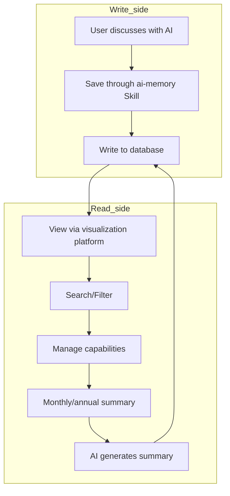

# Personal Capability Center

[](https://github.com/shadowabi/personal-capability-center/issues)
[](https://github.com/shadowabi/personal-capability-center/network/members)
[](https://github.com/shadowabi/personal-capability-center/stargazers)

Personal Capability Center is a personal capability management system based on PostgreSQL + pgvector, implementing structured storage, visual management, and intelligent growth analysis of AI conversation capabilities.

## Core Philosophy

### Capability Extraction (Core)
Every conversation with AI may bring about cognitive leaps. The system **does not store original conversation text**, but instead extracts **reusable capabilities** from the conversation, transforming scattered thoughts into traceable, analyzable personal capability assets.

> **⚠️ Important Distinction**:
> - **What is stored**: Extracted capabilities (cognitive leaps, capability definitions, application scenarios)
> - **What is NOT stored**: Original conversation text (redundant trial-and-error, repetitive discussion processes)
> - **Why**: Capabilities are reusable, conversations are not. Storing capabilities = storing wisdom, storing conversations = storing noise

### Capability vs Knowledge Point
- **Knowledge Point**: "P/E ratio = stock price / earnings per share" (What it is, not reusable)
- **Capability**: "Dynamic valuation: Understanding that metrics reflect future expectations rather than static reality" (How to use, reusable)
- **System Focus**: Storing **capabilities**, not knowledge points

### Guided Growth
Through monthly/annual report functionality, systematically review and summarize to achieve continuous capability iteration and improvement.

### System Capabilities
- **Structured Storage**: Store extracted capabilities as queryable, manageable structured data
- **Semantic Search**: Vector search based on pgvector for intelligent capability retrieval
- **Growth Analysis**: Visualize capability growth trajectory through statistical and reporting functions

## System Definition

Personal Capability Center consists of the following two parts:

### 1. ai-memory (Skill)
- SKILL module for user-facing AI
- Provides a complete set of functionality for memory database write and read operations
- Responsibility: Data writing

### 2. Visualization Platform (Frontend + Backend)
- Provides capability query, filtering, and management functionality
- Supports automatic generation of monthly/annual reports
- Responsibility: Data reading, management, and analysis

## Platform Features

### Intelligent Memory Management
- Structured storage of capabilities (title, capability definition, cognitive transformation process)
- Tag classification and management
- Importance marking (high/medium/low)

### Capability Inventory System
- Capability list viewing and filtering
- Semantic search based on pgvector
- Statistical analysis functionality

### Report Generation
- Monthly/annual summary functionality
- AI automatically generates summary reports
- Reports saved back to database

### Capability Records
- **SKILL Module**: Python SDK provides complete database write/read API
- **Visualization Platform**: Web interface for capability management and querying
- **On-demand Interaction**: Reduces token consumption, only generates interactions when requested by users

### System Features
- **Private Deployment**: Data stored in local PostgreSQL
- **Modular Architecture**: Can integrate different AI tools (OpenCode, OpenClaw, etc.)
- **On-demand Write/Read**: Independent system, only generates interactions when requested by users

## Usage Examples

### Scenario 1: Record AI Capabilities
```
User: Use AI-Memory SKILL to summarize current conversation and write to database
AI: Successfully saved capability to database (Title: How to use PostgreSQL)
```

### Scenario 2: Query Historical Capabilities
```
User: Use AI-Memory SKILL to view capabilities related to vector search
AI: Found 3 related capabilities:
1. pgvector basic usage (2025-12-01)
2. Semantic search optimization (2025-12-05)
...
```

### Scenario 3: Generate Monthly Summary
1. Login to frontend platform (http://localhost:5173)
2. Click "Monthly Summary" button
3. Backend calls OpenCode AI to generate summary
4. View capability improvement report

### Scenario 4: Summarize Conversation into Capabilities via ai-memory Skill (Example)

> **💡 Feature Description**: This is the capability extraction functionality provided by ai-memory Skill, used to save capabilities mastered in a single conversation to the database.
>
> **Difference from Monthly Summary**:
> - **Capability Extraction** (this scenario): Specific capabilities mastered in a single conversation (e.g., "Task Decomposition Capability")
> - **Monthly Summary** (platform feature): Comprehensively analyze all capability records to generate higher-level growth reports
>
> This scenario demonstrates the **capability extraction** process.

Assume you have the following conversation content:

```
User: I can never complete my plan. I list 10 tasks every day, but only complete 3. It's frustrating.

AI: You mentioned you only complete 3 tasks. What do these 3 tasks have in common?

User: Usually urgent but important tasks, like meetings and replying to emails. The unfinished ones are important but not urgent, like studying and exercising.

AI: Interesting observation. Why do you think important but not urgent tasks are always postponed?

User: Because they don't have deadlines. Nothing happens immediately if I don't do them.

AI: So if we set explicit deadlines for these important but not urgent tasks, what would change?

User: Hmm, it might be easier to start. But I still procrastinate.

AI: You mentioned "procrastination." What do you think is the essence of procrastination?

User: Because the tasks are too big, I don't know where to start.

AI: If a big task is decomposed into 5 small tasks, and each small task only takes 10 minutes, would you still procrastinate?

User: Probably not, because 10-minute tasks are easy to do.

AI: So the root of procrastination might not be laziness, but psychological pressure caused by tasks being too big?

User: Right, I never thought about it from this angle. So the solution is: decompose big tasks into small tasks, and set explicit deadlines for each small task?

AI: Excellent. You've mastered a set of methods. Can you summarize them?

User: 1. Task decomposition: Break big tasks into 10-minute small tasks
2. Set deadlines: Each small task has an explicit deadline
3. Prioritize important but not urgent tasks
```

**Complete Example of Summarizing into Capabilities**:

```python
import sys
sys.path.insert(0, r'C:\Users\shadow\.config\opencode\skills\ai-memory')

from scripts.ai_memory import AIMemory, generate_mock_embedding

# ===== Content to save =====

# 1. title: Describe cognitive leap
title = "Cognitive leap from 'too many tasks to complete' to 'task decomposition + deadlines'"

# 2. summary: Structured summary
summary = """Problem background: List 10 tasks every day, only complete 3, feel frustrated

Mastered capabilities:
1. Task decomposition capability: Decompose big tasks into 10-minute small tasks
2. Deadline setting capability: Each small task has an explicit deadline
3. Priority management capability: Prioritize important but not urgent tasks

Deep insights:
- The root of procrastination is not laziness, but psychological pressure caused by tasks being too big
- Important but not urgent tasks are postponed because they lack deadlines
- Small tasks are easy to start, psychological pressure is low"""

# 3. details: Complete thinking process
details = """Problem background:
- Initial situation: List 10 tasks every day, only complete 3, feel frustrated
- Existing cognition: Urgent tasks get completed, important but not urgent tasks get postponed
- Confusion point: Why are important but not urgent tasks always postponed?

---

My mastered capabilities:

Capability 1: Task decomposition capability
Capability definition: Decompose big tasks into easily executable small tasks, reducing psychological pressure
Reflected in deep insights:
- Big tasks cause psychological pressure, the essence of procrastination is not laziness
- 10-minute small tasks are easy to start, psychological pressure is low

Cognitive transformation process:
- Original cognition: Procrastination is due to laziness, inability to complete tasks is poor self-discipline
- Guided question: "What do you think is the essence of procrastination?"
- Guided follow-up: "If a big task is decomposed into 5 small tasks, each small task only takes 10 minutes, would you still procrastinate?"
- Breakthrough point: Realize that 10-minute tasks are easy to do, won't procrastinate
- New cognition: The root of procrastination is psychological pressure caused by tasks being too big, solution is task decomposition

---

Capability 2: Deadline setting capability
Capability definition: Set explicit deadlines for tasks to create urgency
Reflected in deep insights:
- Important but not urgent tasks are postponed because they lack deadlines
- Explicit deadlines can prompt action

Cognitive transformation process:
- Original cognition: Important but not urgent tasks don't need to be done immediately, so they always get pushed back
- Guided question: "If we set explicit deadlines for these important but not urgent tasks, what would change?"
- Realize: Tasks with deadlines are easier to start
- New cognition: Important but not urgent tasks need artificially created deadlines

---

Capability 3: Priority management capability
Capability definition: Prioritize important but not urgent tasks, avoid always being occupied by urgent tasks
Reflected in deep insights:
- Urgent but important tasks automatically get completed (meetings, replying to emails)
- What can't be completed is important but not urgent tasks (studying, exercising)
- Only by actively managing important but not urgent tasks can we avoid passive response

Cognitive transformation process:
- Original cognition: List 10 tasks every day, complete as many as possible
- Guided observation: "What do the 3 tasks you complete have in common?"
- Realize: Completed ones are urgent but important, incomplete ones are important but not urgent
- Guided clarification: "Why are important but not urgent tasks always postponed?"
- Breakthrough point: Realize must actively manage important but not urgent tasks
- New cognition: Prioritize important but not urgent tasks, and execute them using task decomposition + deadlines"""

# 4. tags: Tag classification
tags = ['Time Management', 'Task Management', 'Cognitive Leap']

# 5. importance: Importance score (1-10)
importance = 9

# 6. word_count: Word count
word_count = len(details)

# ===== Save to database =====

memory = AIMemory()
embedding = generate_mock_embedding()  # Generate mock vector (use real embedding model in production)
conv_id = memory.add_conversation(
    title=title,
    summary=summary,
    details=details,
    embedding=embedding,
    tags=tags,
    importance=importance,
    word_count=word_count
)
print(f"Successfully saved, conversation ID: {conv_id}")
memory.close()
```

**Key Points**:
- ✅ **title**: Describe cognitive leap (from "X" to "Y")
- ✅ **summary**: Structured summary, including problem background, mastered capabilities, deep insights
- ✅ **details**: Complete thinking process, each capability includes capability definition, reflected in deep insights, cognitive transformation process
- ✅ **Cognitive transformation process**: Original cognition → Guided question → Breakthrough point → New cognition
- ✅ **Capability vs Knowledge Point**: Capability is "how to use", reusable; knowledge point is "what it is", not reusable

## Applicable Scenarios

- **AI Capability Management**: Long-term preservation of capabilities extracted from AI conversations, forming personal capability library
- **Skill Growth Tracking**: Systematically review learning outcomes through monthly/annual reports
- **Capability Resource Review**: Find historical related capabilities quickly based on semantic search
- **Personal Capability Inventory**: Understand your capability growth trajectory through statistical analysis

## Technical Highlights

### Backend Technology
- **FastAPI**: High-performance async web framework, supports automatic API documentation generation
- **PostgreSQL 16 + pgvector**: Supports vector similarity search, HNSW algorithm accelerates million-level vector retrieval

### Frontend Technology
- **React 18 + Vite**: Modern frontend architecture, ultra-fast build experience
- **shadcn/ui**: High-quality UI component library
- **Framer Motion**: Smooth animation effects

### AI Integration
- **Python SDK**: Complete AIMemory class, can directly call database operations
- **Progressive Loading**: Three-level loading mechanism (metadata → SKILL.md → references)

---

## Project Structure

```
ai-memory-dashboard/
├── skills/                   # Skills directory
│   └── ai-memory/           # AI Memory Skill
│       ├── SKILL.md         # Skill documentation
│       ├── scripts/         # Python SDK
│       │   ├── ai_memory.py # AIMemory class
│       │   ├── test_ai_memory.py  # Test script
│       │   └── quick_test.py    # Quick test
│       ├── references/      # Complete documentation
│       │   ├── API_REFERENCE.md
│       │   ├── INSTALL.md
│       │   ├── CONTENT_GUIDELINES.md
│       │   ├── TESTING.md
│       │   ├── WSL2_TROUBLESHOOTING.md
│       │   ├── EXAMPLES.md
│       │   ├── LANGCHAIN.md
│       │   └── SCHEMA.md
│       └── .env.example     # Environment variable example
│
├── backend/                   # Backend service (FastAPI)
│   ├── main.py              # FastAPI main program
│   ├── database.py          # Sync database connection
│   ├── database_async.py    # Async database connection
│   ├── models.py            # Pydantic data models
│   ├── routers/             # API routes
│   │   ├── conversations.py # Conversation management API
│   │   ├── search.py        # Search API
│   │   ├── statistics.py    # Statistics API
│   │   └── summary.py       # Summary API
│   ├── scripts/             # Utility scripts
│   │   └── init-db.sh       # Database initialization
│   ├── docker-compose.yml   # Database initialization
│   ├── requirements.txt     # Python dependencies
│   └── .env.example         # Environment variable example
│
├── frontend/                 # Frontend application (React + Vite)
│   ├── src/
│   │   ├── components/      # React components
│   │   │   ├── App.tsx
│   │   │   ├── ConversationList.tsx
│   │   │   ├── ConversationDetail.tsx
│   │   │   ├── SearchPage.tsx
│   │   │   ├── SummaryPage.tsx
│   │   │   └── StatisticsPage.tsx
│   │   ├── services/         # API call services
│   │   │   └── api.ts
│   │   ├── types/            # TypeScript type definitions
│   │   │   └── index.ts
│   │   ├── assets/           # Static resources
│   │   ├── App.css
│   │   ├── index.css
│   │   └── main.tsx          # Frontend entry
│   ├── public/               # Public static files
│   ├── package.json          # Frontend dependency configuration
│   ├── vite.config.ts        # Vite configuration
│   └── tsconfig.json        # TypeScript configuration
│
├── docs/                      # Project documentation
│   ├── ARCHITECTURE.md      # System architecture documentation
│   ├── DEVELOPMENT.md       # Development guide
│   ├── API.md              # API documentation
│   └── DEPLOYMENT.md       # Deployment guide
│
├── .gitignore              # Git ignore file configuration
├── README_CN.md            # Project description (Chinese)
├── README.md              # Project description (this file)
└── PRIVACY_CHECK.md       # Privacy check guide
```

---

## Core Flow



### Flow Description

1. **Save Phase**: User discusses valuable content with AI → Save mastered capabilities through ai-memory Skill (abstraction layer)
2. **Read Phase**: Visualization platform to view capability records
3. **Search Phase**: Keyword, tag, importance, etc. search
4. **Manage Phase**: Delete unwanted capability records
5. **Extraction Phase**: Monthly/annual capability inventory → AI comprehensively analyzes all capability records, systematizes → Save back to database

---

## Quick Start

### Environment Requirements

- **Docker** - Used to run all services (database + backend + frontend)
- **OpenCode** (replaceable) - AI assistant, used to interact with database and capability summary

### Deployment Method Comparison

| Deployment Method | Applicable Scenario | Pros | Cons |
|-------------------|---------------------|------|------|
| Docker Compose | Quick start, production | One-click deployment, environment isolation | Need to install Docker |
| Manual Deployment | Development debugging | Flexible control, easy debugging | Need to manually configure environment |

---

### Method 1: Docker Compose One-Click Deployment (Recommended)

#### 1. Start all services

Enter the project root directory and use Docker Compose to start all services:

```bash
cd F:\test\ai-memory-dashboard
docker compose up -d
```

This will automatically start the following three microservices:
- ✅ **PostgreSQL + pgvector** (port 5432)
- ✅ **FastAPI Backend** (port 8000)
- ✅ **React + Vite Frontend** (port 5173)

#### 2. Verify service status

Check if all services are running normally:

```bash
docker compose ps
```

You should see all three services showing `Up` or `Up (healthy)` status.

#### 3. Test access

**Test Backend API**:
```bash
curl http://localhost:8000/health
```
Should return: `{"status":"healthy"}`

**Test Frontend**:
```bash
curl -I http://localhost:5173
```
Should return `HTTP/1.1 200 OK`

**View API Documentation**:
Visit http://localhost:8000/docs

#### 4. Configure OpenCode AI (Optional)

If you want to use monthly/annual summary functionality, you need to configure OpenCode AI:

```bash
# Copy configuration template
cd backend
cp .env.example .env.local

# Edit .env.local, fill in your configuration
# AGENT_NAME=your-agent-name
# MODEL_ID=your-model-id
# PROVIDER_ID=your-provider-id
```

For detailed configuration instructions, please refer to: [CONFIGURATION.md](./CONFIGURATION.md)

#### 5. Stop services

```bash
# Stop all services
docker compose stop

# Stop and delete containers
docker compose down

# Stop, delete containers and volumes (will delete data)
docker compose down -v
```

---

### Method 2: Manual Deployment (Development Debugging)

> **Note**: Manual deployment requires manually configuring environment variables. Docker Compose one-click deployment is recommended.

#### Step 1: Start database

Enter the backend directory and use Docker Compose to start the database:

```bash
cd backend
docker-compose up -d
```

The database will automatically execute initialization scripts to create the following:
- ✅ pgvector extension
- ✅ conversations table (conversation records)
- ✅ tags table (tags)
- ✅ conversation_tags association table
- ✅ vector column (for semantic search)

Verify if the database started successfully:

```bash
docker ps | grep ai-memory-postgres
```

#### Step 2: Start backend

##### 2.1 Install Python dependencies

```bash
cd backend
pip install -r requirements.txt
```

##### 2.2 Configure environment variables

Create a `.env` file from the example configuration file:

```bash
# Windows (PowerShell)
cd backend
Copy-Item .env.example .env

# Linux/Mac
cd backend
cp .env.example .env
```

The `.env` file contains the following configuration:

```bash
# Database connection
AI_MEMORY_HOST=localhost
AI_MEMORY_PORT=5432
AI_MEMORY_DB=ai_memory
AI_MEMORY_USER=ai_user
AI_MEMORY_PASSWORD=ai_password_123

# Backend API service
API_HOST=0.0.0.0
API_PORT=8000
# CORS protection configuration
CORS_ORIGINS=http://localhost:5173,http://localhost:3000,http://127.0.0.1:5173

# OpenCode integration
OPENCODE_API_URL=http://127.0.0.1:4096
```

**Note**: The `.env` file is already in `.gitignore` and will not be committed to the Git repository.

##### 2.3 Start backend service

```bash
python main.py
```

The backend will run at: **http://localhost:8000**

View API documentation: **http://localhost:8000/docs**

#### Step 3: Start frontend

##### 3.1 Install Node.js dependencies

```bash
cd frontend
npm install
```

##### 3.2 Start frontend development server

```bash
npm run dev
```

The frontend will run at: **http://localhost:5173**

---

### Step 4: Configure OpenCode AI (Optional, for monthly/annual summary)

If you want to use monthly/annual summary functionality, you need to configure OpenCode AI:

#### 4.1 Create configuration file

```bash
cd backend
cp .env.example .env
```

#### 4.2 Modify configuration file

Edit `backend/.env`, add OpenCode configuration:

```bash
# OpenCode Agent configuration
AGENT_NAME=your-agent-name
MODEL_ID=your-model-id
PROVIDER_ID=your-provider-id

# OpenCode API address
OPENCODE_API_URL=http://127.0.0.1:4096
```

**How to get configuration information**:
```bash
# View available agents
curl -s http://127.0.0.1:4096/agent

# View available models and providers
curl -s http://127.0.0.1:4096/config/providers
```

#### 4.3 Restart backend service

```bash
# Stop backend service
# Ctrl+C or kill process

# Restart
cd backend
python main.py
```

For detailed configuration instructions, please refer to: [CONFIGURATION.md](./CONFIGURATION.md)

### Step 5: Deploy ai-memory Skill to OpenCode (replaceable)

#### 5.1 Find OpenCode skill directory

Usually located at:
```
C:\Users\{YourUsername}\.config\opencode\skills\
```

#### 5.2 Copy ai-memory folder

```bash
# Linux/Mac
cp -r skills/ai-memory ~/.config/opencode/skills/

# Windows (PowerShell)
Copy-Item -Recurse skills/ai-memory "$env:USERPROFILE\.config\opencode\skills\"

# Or manually copy the skills/ai-memory folder to OpenCode's skills directory
```

Directory structure after copying:
```
skills/ai-memory/
├── SKILL.md              # Skill documentation (~100 lines)
├── scripts/
│   └── ai_memory.py      # AIMemory class
└── references/           # Complete documentation
    ├── API_REFERENCE.md  # API reference
    ├── INSTALL.md        # Detailed installation guide
    ├── CONTENT_GUIDELINES.md  # Content storage guide
    ├── TESTING.md        # Testing and validation
    └── WSL2_TROUBLESHOOTING.md # Troubleshooting
```

#### 5.3 Restart OpenCode (replaceable)

Restart your OpenCode to let the skill system load the updated skill.

---

### Step 5: Start Using

#### 5.1 Record AI Capabilities via Skill

Now your OpenCode AI can use SKILL to operate the database:

```
Query: Use AI-Memory SKILL to view capabilities about XXX
Insert: Use AI-Memory SKILL to summarize current conversation and write to database
```

#### 5.2 View and Manage via Frontend

Visit **http://localhost:5173**

**Complete Workflow**:
1. Discuss valuable content with AI
2. Save to database via Skill (record mastered capabilities, deep insights, cognitive transformation)
3. View and manage via frontend (capability record list, search, statistics)
4. Click monthly/annual capability inventory
5. Backend calls OpenCode to comprehensively analyze all capability records
6. Summary saved back to database (you view capability growth trajectory, capability assessment, growth suggestions)
7. Continue discussing with AI...

---

## Technology Stack

### Backend
- **FastAPI** - High-performance async web framework
- **PostgreSQL 16** - Relational database
- **pgvector** - Vector similarity search, supports HNSW algorithm to accelerate million-level vector retrieval
- **httpx** - Async HTTP client
- **Pydantic** - Data validation

### Frontend
- **React 18** - UI framework
- **Vite** - Ultra-fast build tool
- **Tailwind CSS** - Utility-first CSS framework
- **shadcn/ui** - High-quality UI component library
- **Framer Motion** - Animation library

### AI Memory Skill
- **Python SDK** - Complete AIMemory class, can directly call database operations
- **Progressive Loading** - Three-level loading mechanism (metadata → SKILL.md → references)
- **Complete API** - Complete documentation and examples for all methods

---

## Troubleshooting

### Backend startup failure

```bash
# Check if PostgreSQL is running
docker ps | grep postgresql

# View backend logs
cd backend
cat backend.log
```

### Database connection failure

```bash
# Test database connection
PGPASSWORD=ai_password_123 psql -h localhost -U ai_user -d ai_memory -c "SELECT version();"
```

### OpenCode API call failure

```bash
# Check if OpenCode is running
curl http://127.0.0.1:4096/health

# Check .env configuration (Docker deployment)
docker exec ai-memory-backend env | grep -E '(AGENT_NAME|MODEL_ID|PROVIDER_ID)'

# Check .env configuration (manual deployment)
cat backend/.env | grep -E '(AGENT_NAME|MODEL_ID|PROVIDER_ID)'

# View backend logs
docker logs ai-memory-backend
```

For detailed configuration, please refer to: [CONFIGURATION.md](./CONFIGURATION.md)

### Windows WSL2 Issues

- Ensure Docker Desktop is running
- Check WSL2 version: `wsl --version`
- Refer to `skills/ai-memory/references/WSL2_TROUBLESHOOTING.md`

---

## Complete Documentation

For more detailed documentation, please refer to:

### Core Documentation
- **README.md** - Project overview and quick start (this file)
- **README_CN.md** - Chinese version

### AI Memory Skill
- **AI Memory Skill**: `skills/ai-memory/SKILL.md` - Python SDK complete documentation
- **API Reference**: `skills/ai-memory/references/API_REFERENCE.md` - All API method descriptions
- **Installation Guide**: `skills/ai-memory/references/INSTALL.md` - Detailed installation steps
- **Content Storage**: `skills/ai-memory/references/CONTENT_GUIDELINES.md` - How to correctly store conversation content
- **Testing and Validation**: `skills/ai-memory/references/TESTING.md` - Test scripts and validation methods
- **Troubleshooting**: `skills/ai-memory/references/WSL2_TROUBLESHOOTING.md` - WSL2 and PostgreSQL issues

### Backend Documentation
- **Backend Installation Guide**: `backend/docs/INSTALL.md`
- **Backend API Reference**: `backend/docs/references/API_REFERENCE.md`

### Configuration Documentation
- **Complete Configuration Guide**: [CONFIGURATION.md](./CONFIGURATION.md) - OpenCode AI configuration, environment variable description, troubleshooting

---

## Contributing

Issues and Pull Requests are welcome!

---
