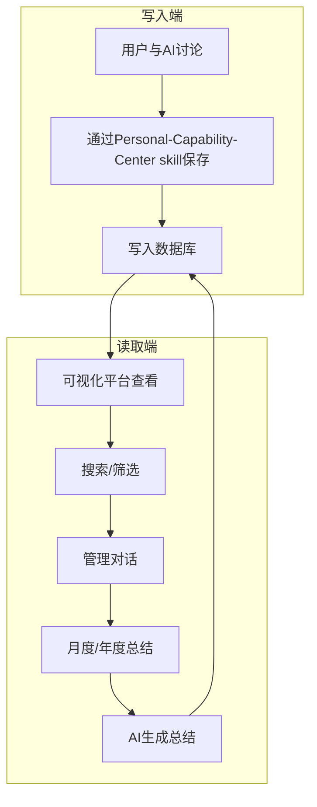

# Personal Capability Center / 个人能力中心

[](https://github.com/shadowabi/personal-capability-center/issues)
[](https://github.com/shadowabi/personal-capability-center/network/members)
[](https://github.com/shadowabi/personal-capability-center/stargazers)

Personal Capability Center是基于PostgreSQL + pgvector的个人知识管理系统，实现AI对话内容的结构化存储、可视化管理和智能化成长分析。

## 核心特性

- **记录用户能力**：使用Personal-Capability-Center skill从对话中提取能力，保存到数据库
- **管理能力记录**：可视化平台可查看、搜索、删除能力记录
- **生成能力总结报告**：月度/年度总结，从分类、评估、追踪、重点分析、成长建议纬度总结能力
- **私有化部署** : 数据自主可控
- **能力模块化** : 可适配各类AI工具如OpenCode、OpenClaw，默认支持opencode

---

## 快速开始

### 1. 启动服务

进入项目根目录，使用 Docker Compose 启动所有服务：

```bash
cd personal-capability-center
docker compose up -d
```

### 2. 验证启动成功

查看所有服务是否正常运行：

```bash
docker compose ps
```

应该看到三个服务都显示为 `Up` 或 `Up (healthy)` 状态。

访问前端：http://localhost:5173

### 3. 配置（可选）

如果需要使用月度/年度总结功能，配置 OpenCode AI：

```bash
cd backend
cp .env.example .env
# 编辑 .env，填入你的配置
```

详细配置说明请参考：[CONFIGURATION.md](./CONFIGURATION.md)

---

## 使用示例

### 场景1：记录AI能力
```
用户：使用 Personal-Capability-Center skill 总结当前对话并写入
AI：已保存能力到数据库（标题：如何使用PostgreSQL）
```

### 场景2：查询历史能力
```
用户：使用 Personal-Capability-Center skill 查看关于向量搜索的能力
AI：找到3条相关能力：
1. pgvector基础使用（2025-12-01）
2. 语义搜索优化（2025-12-05）
...
```

### 场景3：生成月度总结（默认使用opencode api，其他工具需要对backend\routers\summary.py进行适配性改造）
1. 登录前端平台（http://localhost:5173）
2. 点击"月度总结"按钮
3. 后端调用OpenCode AI生成总结
4. 查看能力总结报告

---

## 工作流程



1. 保存阶段：用户与AI讨论有价值的内容 → 通过Personal-Capability-Center skill保存掌握的能力（抽象层）
2. 读取阶段：可视化平台查看能力记录
3. 检索阶段：关键词、标签、重要性等搜索
4. 管理阶段：删除不需要的能力记录
5. 能力成长阶段：月度/年度能力盘点 → AI综合分析所有能力记录（分类、评估、追踪）→ 规划学习路径 → 形成体系化和可复用 → 保存回数据库

---

## 技术栈

### 后端
- **FastAPI** - 高性能异步Web框架
- **PostgreSQL 16** - 关系型数据库
- **pgvector** - 向量相似度搜索，支持HNSW算法加速百万级向量检索
- **httpx** - 异步HTTP客户端
- **Pydantic** - 数据验证

### 前端
- **React 18** - UI框架
- **Vite** - 极速构建工具
- **Tailwind CSS** - 实用优先的CSS框架
- **shadcn/ui** - 高质量UI组件库
- **Framer Motion** - 动画库

---

## 故障排查

### 后端启动失败

```bash
# 检查PostgreSQL是否运行
docker ps | grep postgresql

# 查看后端日志
cd backend
cat backend.log
```

### 数据库连接失败

```bash
# 测试数据库连接
PGPASSWORD=ai_password_123 psql -h localhost -U ai_user -d ai_memory -c "SELECT version();"
```

### OpenCode API调用失败

```bash
# 检查OpenCode是否运行
curl http://127.0.0.1:4096/health

# 检查.env配置
docker exec ai-memory-backend env | grep -E '(AGENT_NAME|MODEL_ID|PROVIDER_ID)'

# 查看后端日志
docker logs ai-memory-backend
```

详细配置请参考：[CONFIGURATION.md](./CONFIGURATION.md)

---

## 完整文档

更详细的文档请参考：

### 核心文档
- **README.md** - 项目概述和快速开始（本文件）

### Personal-Capability-Center skill
- **Personal-Capability-Center skill**：`skills/personal-capability-center/SKILL.md` - SKILL 主要文件

### 后端文档
- **后端安装指南**：`backend/docs/INSTALL.md`
- **后端 API 参考**：`backend/docs/references/API_REFERENCE.md`

### 配置文档
- **完整配置指南**：[CONFIGURATION.md](./CONFIGURATION.md) - 配置、环境变量说明

---

## 贡献

欢迎提交 Issue 和 Pull Request！

---
